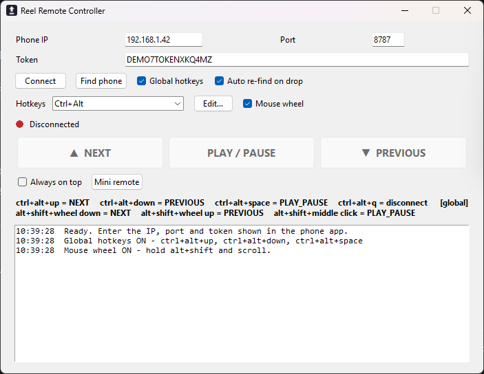
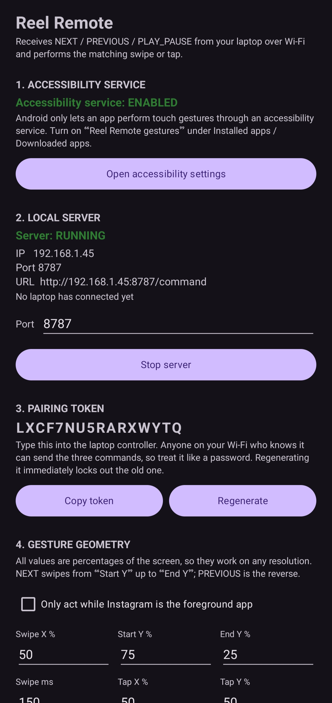
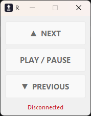

# Reel Remote

Scroll short-form video on your phone without touching it.

Your phone sits in a stand playing Instagram Reels. Your laptop drives it — arrow
keys, the mouse wheel, or a small floating button pad. No screen mirroring, no
remote desktop, no account anywhere.

Reels is what it was built for, not what it is limited to. The phone performs a
swipe and a tap at coordinates you choose and never looks at what is on screen,
so any full-screen vertical feed answers to the same three commands.



---

## What it does

**Three commands, nothing else.** Next Reel, previous Reel, play/pause. The phone
performs a swipe or a tap and does nothing more.

**Any vertical video app.** Nothing in the gesture path knows what Instagram is —
it is a swipe up, a swipe down and a centre tap at percentages of the screen.
TikTok, YouTube Shorts, Snapchat Spotlight, Reddit and Facebook Reels all use the
same interaction, so they all work. Untick *Only act while Instagram is the
foreground app* and point it at whatever you like.

**Keyboard shortcuts that don't fight you.** `Ctrl+Alt+Up`, `Ctrl+Alt+Down`,
`Ctrl+Alt+Space` work system-wide, so the controller can sit behind your browser.
They use modifiers on purpose — no key is swallowed from whatever you are
actually typing in.

**Mouse control.** Hold `Alt+Shift` and scroll. Middle-click to pause. The wheel
is intercepted only while those modifiers are held; the rest of the time it
scrolls normally.

**Rebindable.** Every shortcut, the wheel modifiers and the wheel direction can
be changed and are remembered.

**Paired, not open.** The phone generates a random token and refuses anything
that doesn't present it, or that arrives from outside the local network.

**Buttons, and a mini remote.** Three real buttons in the window, or a small
always-on-top pad with just the buttons on it — park it in a corner and click
away while the browser has focus. They grey out while disconnected, so the state
is never ambiguous.

<table>
<tr>
<td width="50%" align="center"></td>
<td width="50%" align="center"></td>
</tr>
<tr>
<td align="center"><em>The phone: status, address, token, gesture tuning.</em></td>
<td align="center"><em>The mini remote, pinned above everything else.</em></td>
</tr>
</table>

---

## Built with

Kotlin · Android AccessibilityService · Python · Tkinter · Win32

No networking library on either side. The phone's HTTP server is about three
hundred lines of `java.net` and `org.json`; the controller talks to it with
`requests`. The mouse hook is a raw `WH_MOUSE_LL` hook through `ctypes`.

---

## What you need

- A phone on Android 8.0 or newer, and a Windows laptop on the same Wi-Fi.
- Android Studio and JDK 17 to build the app.
- Python 3.10 or newer for the controller.

The two devices talk directly over your LAN. Nothing reaches the internet.

---

## Build the Android app

Open the `android/` folder in Android Studio and let it sync, then:

```
Build → Build Bundle(s) / APK(s) → Build APK(s)
```

Or from a terminal:

```bash
cd android
./gradlew assembleDebug     # app/build/outputs/apk/debug/app-debug.apk
```

Install it over USB with `adb install -r <path>`, or copy it to the phone and
open it — but read **[Installing on Android](#installing-on-android)** first,
because Android will fight you.

### Release builds

`./gradlew assembleRelease` produces the signed APK that ships on the releases
page. Signing reads `android/keystore.properties`, which is **not** in version
control:

```properties
storeFile=keystore/reelremote.jks
storePassword=…
keyAlias=reelremote
keyPassword=…
```

Without that file the release build still succeeds, it just produces an unsigned
APK that Android will refuse to install. The keystore is the app's identity — if
it is lost, no future build can update an already-installed copy, so keep a
backup somewhere other than this machine.

---

## Installing on Android

Android blocks this app on install, and then blocks the permission it needs
afterwards. Both are expected. Neither means the download is broken.

**Why.** The app performs swipes through an `AccessibilityService` — the only
API Android provides for synthesising a touch. It is also the API banking
trojans and stalkerware abuse, so Play Protect blocks *any* sideloaded app that
requests it, whatever the app actually does. Signing does not change this;
nothing short of shipping through the Play Store does. For reference, Reel
Remote requests exactly two permissions, `INTERNET` and `ACCESS_NETWORK_STATE`,
and its service declares `canRetrieveWindowContent="false"` so it cannot read
your screen.

### 1. Get past the install block

You will see **"App blocked to protect your device"**.

**If there is an "Install anyway" option:** tap *More details* → *Install
anyway*. Done.

**If there is no way through at all**, your manufacturer is blocking it, not
Google. Turn the relevant one off, install, then turn it back on:

| Phone | Setting |
|---|---|
| Samsung (One UI 6.1+) | Settings → Security and privacy → **Auto Blocker** → off |
| Xiaomi / Redmi / POCO | Settings → Privacy protection → Special permissions → Install unknown apps. Some builds also need **MIUI optimization** off in Developer options |
| Realme / Oppo / Vivo | Settings → Additional settings → Install unknown apps, and disable *Payment protection* / *App verification* |
| Any phone | Play Store → your avatar → **Play Protect** → ⚙ → *Scan apps with Play Protect* off |

**Or bypass all of it over USB.** ADB does not use the Play Store installer, so
none of the above applies:

```bash
# Settings → About phone → tap "Build number" seven times
# Settings → System → Developer options → USB debugging → on
adb install -r ReelRemote.apk
```

### 2. Allow the accessibility service

On Android 13 and newer the accessibility toggle is greyed out for sideloaded
apps until you unlock it. This is *Restricted Settings*, a separate mechanism
from the install block:

**Settings → Apps → Reel Remote → ⋮ (top right) → Allow restricted settings**

Then **Settings → Accessibility → Reel Remote gestures → On**.

Skip this step and the app installs perfectly, opens perfectly, and does
nothing — with no error to explain why. It is the single most common reason
people give up.

---

## Run the controller

```bash
cd windows
python -m venv .venv
.venv/Scripts/pip install -r requirements.txt
.venv/Scripts/python reel_remote_controller.py
```

`keyboard` is optional. Without it everything still works, but the shortcuts only
fire while the controller window is focused — Windows gives no other way to see a
keystroke meant for a different application.

To build a standalone executable:

```bash
pip install pyinstaller
pyinstaller --noconfirm --onefile --windowed --name ReelRemote \
            --icon assets/reelremote.ico \
            --add-data "assets;assets" \
            --hidden-import keyboard reel_remote_controller.py
```

`--icon` sets the icon on the executable itself; `--add-data` bundles the same
file so the running window and the mini remote show it too. On Linux or macOS the
`--add-data` separator is `:` rather than `;`.

---

## Pairing, the first time

1. Open the app on the phone and tap **Open accessibility settings**. Turn on
   **Reel Remote gestures**. Android has no other way to let an app perform a
   touch gesture. If the toggle is greyed out, you still need
   [Allow restricted settings](#2-allow-the-accessibility-service).
2. Back in the app, press **Start server**. It shows the phone's IP, the port and
   a sixteen-character pairing token.
3. Type all three into the controller and press **Connect**. The dot turns green.
4. Open Instagram Reels on the phone and press `Ctrl+Alt+Up`.

Leave the IP blank and press **Find phone** to scan the local network for it
instead. Settings are remembered in `%APPDATA%\ReelRemote\controller.json`.

### When it doesn't connect

- **Check the IP again.** Phones change address between Wi-Fi sessions. The app
  always shows the current one.
- **Router client isolation.** Guest networks and the "AP isolation" setting
  block devices from reaching each other. This is the most common cause.
- **Test the phone directly:** `curl -H "X-Auth-Token: <token>" http://<ip>:8787/ping`.
  JSON back means the phone is fine and the problem is on the laptop side.
- **Commands refused rather than failing.** Read the error in the log:
  `SCREEN_LOCKED` means unlock the phone, `GESTURE_FAILED` means toggle the
  accessibility service off and on, and `TARGET_NOT_FOREGROUND` means the target
  app isn't in front — open Instagram, or untick the foreground checkbox if you
  are driving a different app.
- **The swipe overshoots by two Reels.** It is too fast — raise *Swipe ms* to 300
  in the phone app.

---

## How it works underneath

**[docs/ARCHITECTURE.md](docs/ARCHITECTURE.md)** covers the design decisions: why
the server lives inside the accessibility service instead of a foreground
service, how gesture geometry survives different screen sizes, why the hotkeys
avoid key suppression, what the phone validates before it moves a finger, and the
things this build gets wrong on purpose.

---

## Licence

MIT — see [LICENSE](LICENSE). Do what you like with it.

---

## Support

If you find this project useful, you can support my work by buying me a chai.

<a href="https://buymeachai.ezee.li/Jasgunsingh">
  
</a>
